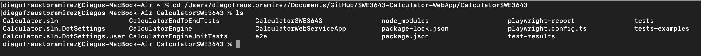
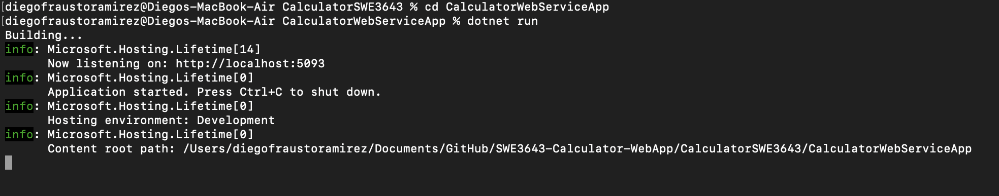
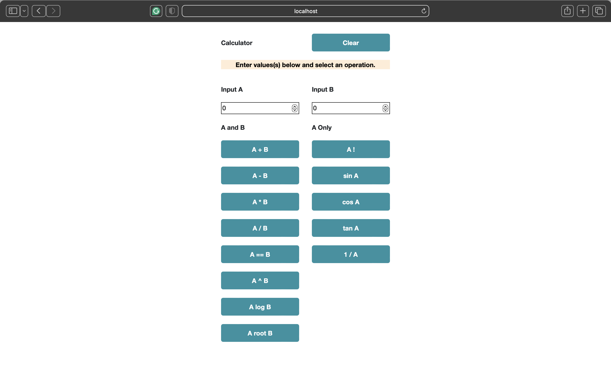
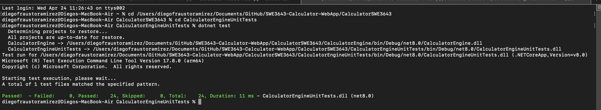

# SWE3643-Calculator-WebApp
## KSU SWE 3643 Software Testing and Quality Assurance Semester Project: Web-Based Calculator
This repository contains our semester-long project for our *SWE 3643 Quality Assurance Course*.
We designed a simple __Web-Based Calculator__ in C# using Blazor Server, wrote unit tests using NUnit, and wrote end-to-end tests using Playwright with NUnit.
## Table of Contents
- [Team Members](#team-members)
- [Architecture](#architecture)
- [Environment](#environment)
- [Executing the Web Application](#executing-the-web-application)
- [Executing Unit Tests](#executing-unit-tests)
- [Reviewing Unit Test Coverage](#reviewing-unit-test-coverage)
- [Executing End-To-End Tests](#executing-end-to-end-tests)
- [Final Video Presentation](#final-video-presentation)

## Team Members
- [Diego Frausto Ramirez](https://github.com/DiegoFraR)
- [Victoria Miller](https://github.com/vjr98) 

## Architecture
This project is split into 4 distinct sections. The calculator engine, the calculator engine unit tests,
the web application, and the end-to-end tests. 
The calculator engine section contains all the calculator logic, such as basic arithmetic, trigonometric functions, 
and other various functions. The calculator engine unit test section contains all the unit tests for the calculator
engine. These tests include verifying the correct result comes as a result of the arithmetic requested, when errors occur
(such as dividing by 0), and other tests to ensure the calculator logic is functional and 100% accurate. The web application section
contains the user interface and controller (bundled together in the Calculator.Razor file) which calls the calculator logic
directly to use the logics functions. The diagram below shows the architecture implemented into this project which depicts the calculator logic,
calculator engine unit tests, web application, and end-to-end tests being in their own separate "projects" under the same solution. 

## Environment
This is a cross-platform application and should work in Windows 10+, Mac-OS Ventura+, and linux environments. This application was developed in both a 
Windows and macOS environment, using JetBrains Rider. For the best experience using this application, I recommend downloading
[JetBrains Rider](https://www.jetbrains.com/rider/) and running it on a Windows or macOS device. 

To Prepare your environment to execute this application:
1. [Install the latest .NET for your system](https://dotnet.microsoft.com/en-us/download/dotnet/8.0)
2. [Install JetBrains Rider(Optional)](https://www.jetbrains.com/rider/)
3. Clone this GitHub Repository using the __git clone__ command in the command line/terminal. (Shown below)
````bash
git clone https://github.com/DiegoFraR/SWE3643-Calculator-WebApp
````
If you are using JetBrains Rider, simply open the project in Rider and click the green run button at the top-right of the page. (Shown Below)

To configure Playwright for End-To-End Testing:
1. [Install Playwright to the directory of this project.](https://playwright.dev/docs/intro)

## Executing the Web Application
1. Ensure you have completed all the required steps in the previous [Environment](#environment) section.
2. Using the terminal/Command Line, navigate to the directory of this project on your machine using the cd command. This directory is where you will then 
navigate to the respective solutions that run the web application, unit tests, and end-to-end tests. This directory will look something like this (type ls after entering the directory to see the listings):

3. Navigate to the directory 'CalculatorWebServiceApp' using the following command
```bash
cd CalculatorWebServiceApp
```
4. Once in this directory, run the following command: 
```bash
dotnet run
```
5. After running the command, the terminal will look like this:

6. Launch your web browser (Chrome, Safari, Edge, etc.) and copy the following URL link into your browser head:
```bash
https://localhost:5093/
```
__If this link does not work, pay close attention to the localhost listening the terminal gives you.__
6. You can now interact with the Calculator Web Application!

7. When you are finished using the application, press Control+C twice (Command+C in macOS) in the terminal to terminate the program.

## Executing Unit Tests
__If the application is running, open a new terminal window to do the unit tests.__
1. Navigate to the directory of this project on your machine using the cd command.
2. Navigate to the directory 'CalculatorEngineUnitTests' using the following command
```bash 
cd CalculatorEngineUnitTests
```
3. Once you are in the directory, type or paste the following command to run the unit tests from the terminal:
```bash
dotnet test 
```
4. Review the results you see in the terminal. 24 tests should run and pass. 

## Reviewing Unit Test Coverage
1. For my Calculator Web Application, I am able to obtain 100% coverage of all my methods in my Calculator Engine section. All the method are covered.
   
## Executing End-To-End Tests
1. To run the end-to-end tests, you __must__ have the web application running on your machine. 
2. After running the application, open a new terminal window and navigate to the directory of this project using the cd command.
3. Once in the directory, navigate to the 'CalculatorEndToEndTests' directory using the following command:
```bash
cd CalculatorEndToEndTests
 ```
4. Once in this directory, type or paste the following command to run the end-to-end tests:
```bash
dotnet test
```
5. Review the results you see in the terminal.
*__Add Picture once PlayWright Tests are coded__*
## Final Video Presentation
- [Final Presentation Video]() *MISSING LINK STILL* 

